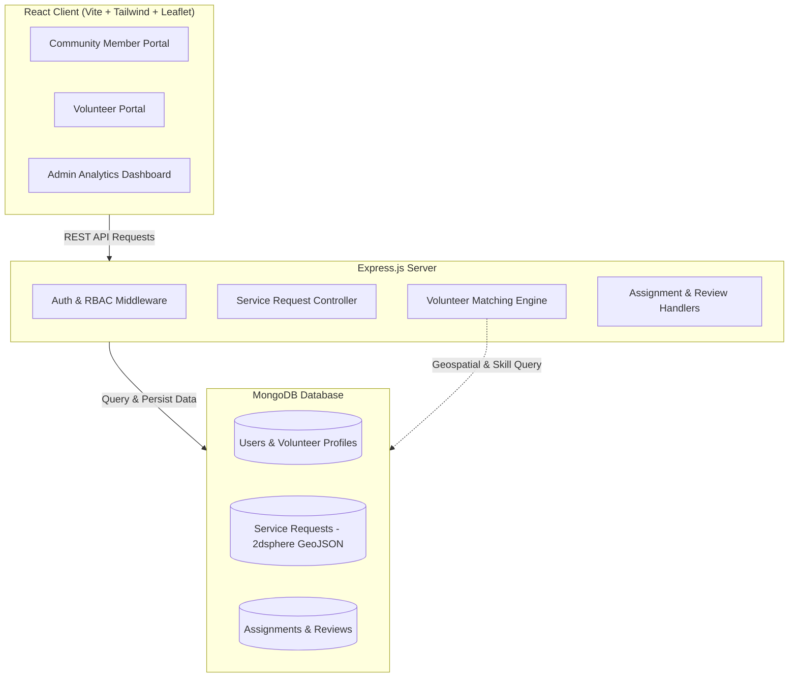
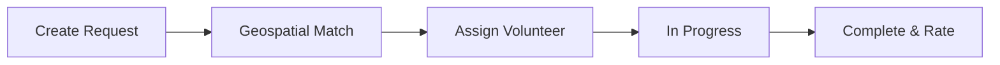

<h1 align="center">SevaSetu</h1> 
<p align="center">Community Service Request and Volunteer Matching Platform</p>

---

## Overview

SevaSetu bridges the gap between everyday community needs (elderly assistance, document support, tutoring, essential deliveries, tech help) and willing local volunteers. By replacing informal, fragmented messaging channels with a centralized platform, SevaSetu ensures requests are quickly routed to suitable nearby volunteers based on proximity, skills, category relevance, availability, and reliability.

---

## Architecture



---

## Service Flow



---

## Multi-Factor Matching Algorithm

The matching engine computes a composite score (0 to 100) using a weighted model:

```
Match Score = (Skill Score * 0.35)
            + (Distance Score * 0.25)
            + (Availability Score * 0.20)
            + (Category Score * 0.10)
            + (Rating Score * 0.10)
```

| Factor | Weight | Description |
|---|---|---|
| Skill Compatibility | 35% | Overlap between requested skills and volunteer skills |
| Geospatial Distance | 25% | Distance score based on volunteer's service radius |
| Time Availability | 20% | Alignment with requested time and day |
| Category Relevance | 10% | Match with volunteer's selected categories |
| Historical Rating | 10% | Average rating from completed tasks |

---

## Key Features

- **Multi-Factor Matching:** Calculates compatibility across skills, location, availability, category, and ratings.
- **Geospatial Mapping:** Interactive map interface using Leaflet and OpenStreetMap for accurate location selection.
- **Lifecycle Tracking:** Real-time request tracking from Pending to Assigned, In Progress, and Completed.
- **Community Impact:** Public impact dashboard displaying completed services and active volunteers.
- **Ratings and Reviews:** Post-service feedback system to maintain trust and reliability.

---

## Technology Stack

- **Frontend:** React 18, Vite, Tailwind CSS, Lucide Icons, Leaflet / React-Leaflet
- **Backend:** Node.js, Express.js, REST API, Express-Validator
- **Database:** MongoDB with 2dsphere Geospatial Indexing, Mongoose ODM
- **Authentication:** JSON Web Tokens (JWT), bcrypt password hashing

---

## API Overview

| Method | Endpoint | Description |
|---|---|---|
| POST | `/api/auth/register` | User registration |
| POST | `/api/auth/login` | User login and JWT issue |
| GET | `/api/auth/me` | Get current user profile |
| POST | `/api/requests` | Create service request |
| GET | `/api/requests` | List service requests |
| GET | `/api/requests/:id/matches` | Get ranked volunteer matches |
| POST | `/api/volunteers/profile` | Update volunteer profile |
| POST | `/api/assignments` | Assign volunteer to request |
| PUT | `/api/assignments/:id/respond` | Accept or decline assignment |
| POST | `/api/reviews` | Submit rating and review |
| GET | `/api/impact/statistics` | View community impact stats |

---

## Project Structure

```
SevaSetu/
|-- client/               # React frontend (Vite + Tailwind CSS)
|   |-- src/
|   |   |-- api/          # API client
|   |   |-- components/   # UI components and map pickers
|   |   |-- context/      # Auth and application state
|   |   |-- layouts/      # App layouts
|   |   |-- pages/        # Views and role portals
|   |   `-- App.jsx
|   `-- package.json
|
|-- server/               # Node.js + Express backend
|   |-- src/
|   |   |-- algorithms/   # Matching algorithm
|   |   |-- config/       # Database configuration
|   |   |-- controllers/  # Route handlers
|   |   |-- middleware/   # Auth and validation
|   |   |-- models/       # Mongoose schemas
|   |   |-- routes/       # API routes
|   |   `-- seeds/        # Sample data seeder
|   |-- server.js
|   `-- package.json
|
`-- README.md
```

---

## Quick Start

### Prerequisites
- Node.js (v18+)
- MongoDB (local or Atlas)

### 1. Clone Repository
```bash
git clone <repository-url>
cd SevaSetu
```

### 2. Backend Setup
```bash
cd server
npm install
cp .env.example .env
npm run dev
```

### 3. Frontend Setup
```bash
cd ../client
npm install
npm run dev
```

---

## Team
- Prabhat Bhatia 
- Suhani Yadav
- Aradhya Mathur 
- Kumar Partha 